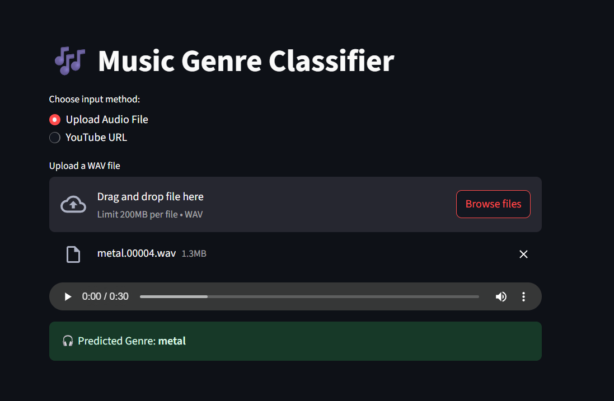

# 🎵 Music Genre Classifier

This project allows you to **predict the genre of a song** using its audio alone — either from a **YouTube URL** or by **uploading your own music clip**!

Built with machine learning, audio signal processing, and an intuitive Streamlit interface.

---

## 🚀 Features

- **Supports both YouTube links & local uploads**
- **Plays audio clip** directly in the app
- **Extracts rich audio features** (MFCCs, chroma, tempo, etc.)
- **Predicts music genre** using a trained ML model
- Deployed on [Streamlit](https://music-genre-clf.streamlit.app/)

---

## 📦 Tech Stack

- **Python**
- **Librosa** for audio feature extraction
- **yt-dlp** + **pydub** for YouTube audio handling
- **Scikit-learn** for preprocessing and pipelining
- **TensorFlow** for model training
- **Streamlit** for interactive UI

---

## 🔍 How It Works

1. User uploads audio or enters a YouTube link
2. App extracts a 30-second audio clip
3. Audio features are computed using `librosa`
4. ML model (here, Neural Network) makes a prediction
5. App displays the **genre prediction**

---

## 🖼️ Preview

### Audio Upload



### Youtube Mode


---

## 🛠️ Local Setup

```bash
git clone https://github.com/InsaneJSK/Music_Genre_Classifier.git
cd Music_Genre_Classifier
pip install -r requirements.txt
streamlit run app.py
```

Make sure FFmpeg is installed and in your system PATH.

## 🎯 Future Enhancements

- CNN-based classifier with spectrogram input

- Dynamic audio waveform synced with playback

## 📜 License

MIT License – use freely, credit appreciated!
